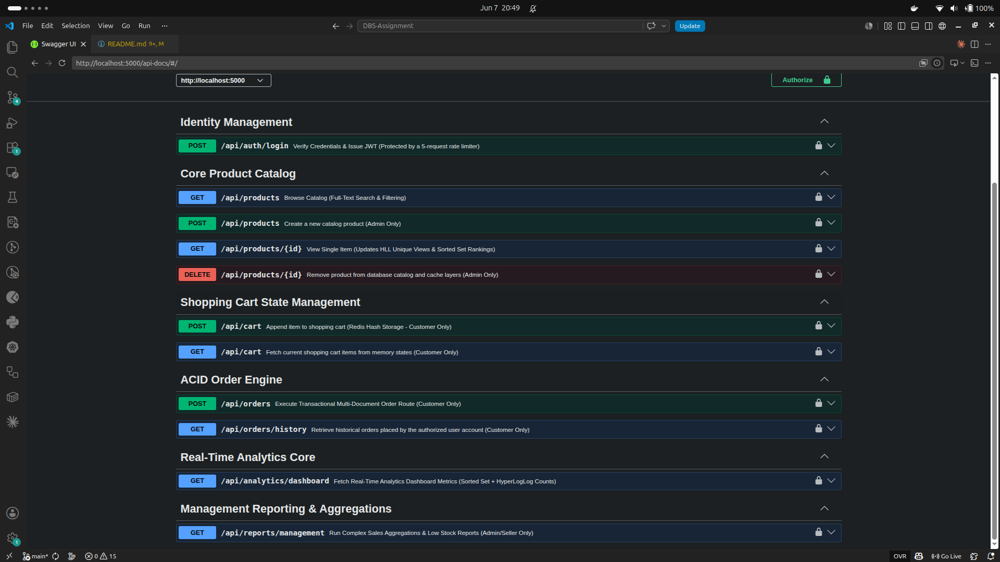
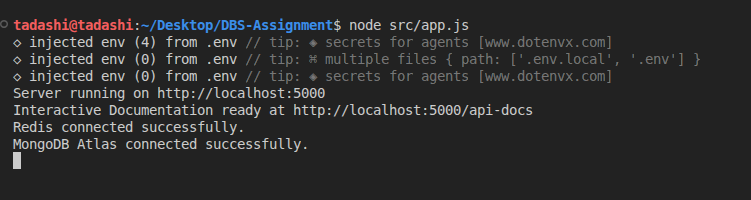
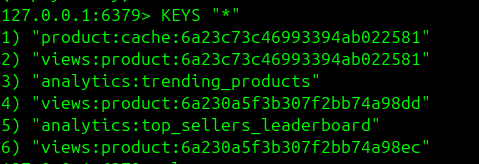
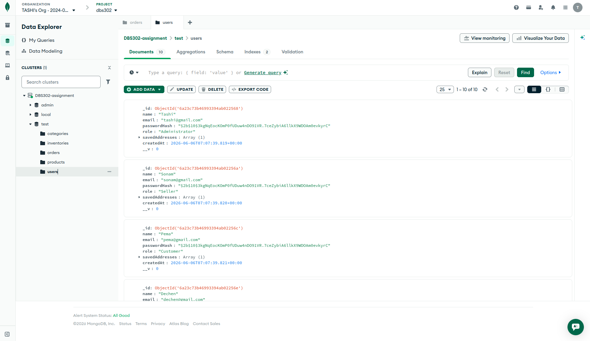

# TashiShop a Hybrid Polyglot E-Commerce Backend

- A high-performance e-commerce backend topology designed to showcase polyglot data architecture. The platform strategically combines **MongoDB Atlas** for long-term cloud persistence and strict transactional integrity, alongside a localized **Redis Core** instance acting as an ultra-low latency memory cache and real-time telemetry computation engine.
- The system decouples high-stakes data paths (like ACID checkouts) from rapid, non-blocking telemetry data streams (such as page views and trending leaderboards). This shields the cloud cluster from resource exhaustion and delivers a $40\times$ acceleration in request throughput compared to standard persistent cloud queries.

---

## Tech Stack

- **Runtime Environment:** Node.js (v18+ or v20+)
- **Application Framework:** Express.js (Model-View-Controller pattern architecture)
- **Primary Persistent Database:** MongoDB Atlas (Cloud Cluster deployment)
- **Object Data Modeling (ODM):** Mongoose (with multi-document session transaction monitoring)
- **In-Memory Operational Accelerator:** Redis Core (Localized system installation)
- **Redis Client Driver:** `redis` (Official Node-Redis Client Node Package)
- **Security & Access Control:** JSON Web Tokens (JWT) with Asymmetric Role-Based Access Control (RBAC)
- **Interactive Documentation Interface:** Swagger UI Engine via OpenAPI 3.0 blueprints

---

## Data Architecture & Modeling

The application utilizes specialized storage engines according to data velocity and structural preservation rules:

### 1. MongoDB Cloud Persistence Layer
- **`users` Collection:** Stores unique account profiles, credentials, and implicit parameters. Location matrices and default payment preferences are **embedded** inside the user profile document to maximize read retrieval rates.
- **`products` Collection:** Houses rich marketing descriptions, categories, and inventory configurations. Product variations (such as physical size, color matrices, and SKU specific pricing) are **embedded** directly to satisfy client catalog lookups in a single sequential disk I/O seek operation.
- **`inventories` Collection:** Tracks stock balances. It uses a 1:1 **reference** pointer targeting the main catalog entry. This decouples fast stock changes from descriptive product text.
- **`orders` Collection:** Serves as an immutable checkout invoice log. It captures price snapshots at the exact moment of checkout, protecting records against future catalog price shifts.

### 2. Localized Redis Memory Layer
- **Catalog Cache (`String` primitive):** Formatted as `product:cache:{id}` with an enforced 1-hour **Cache-Aside** strategy. Includes random **Jitter TTL** padding (1 to 5 minutes) to protect against cache stampedes.
- **Active Shopping Carts (`Hash` primitive):** Formatted as `cart:{userId}` mapping product SKU keys directly to integer numbers. This enables atomic mutations via `hSet` and `hDel` without JSON parsing overhead.
- **Popularity Metrics (`Sorted Set / ZSET` primitive):** Formatted as `analytics:trending_products` enabling instant $O(\log N)$ global popularity updates via atomic `zIncrBy` actions.
- **Audience Streams (`HyperLogLog / HLL` primitive):** Formatted as `views:product:{id}` using `pfAdd` to compress unique IP traffic footprints inside a strict, capped **12KB memory maximum**.

---

## Local Setup Instructions

Follow these step-by-step instructions to clone, configure, and execute the TashiShop platform locally.

### Prerequisites

Ensure **Node.js** (v18.x or higher) is running on your system. Verify using:
```bash
node -v
npm -v
```
Ensure Redis Server is installed locally and listening on its default system port (6379).

Ubuntu/Debian: sudo service redis-server start

macOS (Homebrew): brew services start redis

Windows: Ensure the WSL Redis service or localized native binary execution is running.

Verify local connection responsiveness via CLI:
```cmd
redis-cli ping
# Expected Output: PONG
```

A running MongoDB Atlas Cloud Cluster. (Ensure your network IP address is added to the Atlas Network Access whitelist and copy your primary connection string URI).

Step-by-Step Installation


Clone the Repository & Navigate to Directory:
```cmd
git clone <repository-url>
cd folder name
```

Install Engine Dependencies:
```cmd
npm install
```

Configure Environment Parameters:

Create a .env configuration file in the primary root directory of the project and populate it with the following parameters:
```cmd
# Application Execution Configuration
PORT=5000
NODE_ENV=development

# MongoDB Cloud Database Connection URI String
MONGO_URI=mongodb+srv://<username>:<password>@cluster0.xxxx.mongodb.net/tashishop?retryWrites=true&w=majority

# Localized Redis Memory Cluster Access Coordinates
REDIS_HOST=127.0.0.1
REDIS_PORT=6379

# Security Token Secret Parameters
JWT_SECRET=your_super_secure_random_asymmetric_jwt_secret_phrase
```

Launch the Core Application Server:
```cmd
node src/app.js
// go to the link localhost:5000
```

Verify Server Binding Connection: The console should display the following connection logs

```cmd
[Server] Application process successfully listening on port 5000
[MongoDB] Connected successfully to Atlas Cloud Persistence cluster.
[Redis] Localized memory accelerator client connected successfully.
```

##  API Documentation (Swagger)

The interactive UI Console Endpoint: http://localhost:5000/api-docs

- ```POST /api/auth/login``` : Verifies credentials against hashed database properties, increments the Redis sliding window security counter, and issues a secure signed JWT access token.

- ```GET /api/products``` : Full-text search and filtering engine. Utilizes MongoDB compound text indexes to provide fast $O(1)$ keyword search results.

- ```GET /api/products/:id``` : Fetches a single item profile using the Cache-Aside Pattern. It checks the Redis memory string first, falling back to MongoDB Atlas on a cache miss.

- ```POST /api/products``` : Restricted route. Allows users with the Administrator role to append new catalog profiles. Automatically evicts stale tracking indices.

- ```GET /api/cart``` : Fetches active line items stored in the user's localized Redis Hash matrix.

- ```POST /api/cart``` : Updates shopping cart values in memory and refreshes a rolling 24-hour expiration window.

- ```POST /api/orders/checkout``` : Initiates an orders request session. Automatically opens a multi-document ACID transaction, checks stock availability, updates warehouse counts, and writes an immutable ledger invoice.

1. Interactive Swagger UI Dashboard



2. Active Server Launch Console Logs



3. Redis In-Memory State Proof (CLI)



4. MongoDB Atlas Cloud Collections Browser



