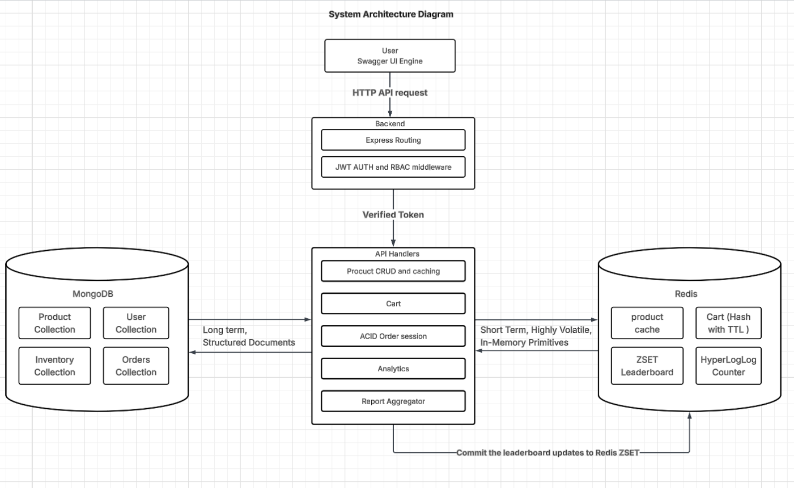
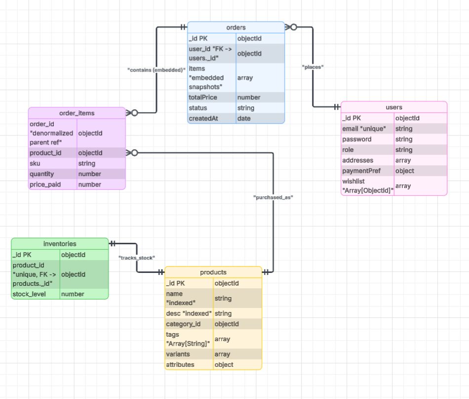

```
- Name : Tashi Penjor
- Student ID : 02230306
- Course : DBS302 - NoSQL Database Management 
- Date : 07/06/2026
- 
```
[Click Here to Stream the Video Presentation](https://drive.google.com/file/d/1zlIZmGjcmQnmvdBhrOZH2YTznguicI3x/view?usp=sharing)
---
### Abstract 

This assignment is the showcast of hybrid datalayer of  MongoDB for long term and persistance storage and redis for high spped localized in memory caching and real time computation.

MongoDB acts as the application immutable single source of truth that utilizing flexible schemas to store the complex e-commerce entities for tracking dynamic product category with consistency during checkouts via multi document ACID transactions. Redis on top of that serves as a low latency performance layer that manages shopping cart sessions with Time To Live expiration policies. The endpoints uses the sliding window rate limiters sorted sets (ZSET) for popularity leaderboards and HyperLogLogs for space efficient unique visit tracking. 

---
### System Architecture



---
### Technology Selection Justification

**Why MongoDB?**
- MongoDB is used because it combines the flexibility of a document based data model with enterprise grade durability. Moreover it allows to store complex evolving data naturally as JSON like document that ensure high availability and scalable performance without sacrificing data integrity. 
- The key architectural reasons is as follows : 
1. Robust data persistence and durability```
- MongoDB has default storage engine used as in memory cache for fast read and write purpose that guarantees data safety using Write ahead logging (WAL). Ontop of that before any change is applied to main database file, it is saved in the commit log, ensuring to survive the power blackout and restore its state perfectly upon restart. Moreover the wiredTiger periodically writes snapshots of the in memory data to disk as a structured data files to balance high performance with permanent disk storage. 

2. High availability and disaster recovery
- MongoDB maintain multiple copies of the database across different servers. If a primary database node fails the cluster automatically and instantaneously elects a secondry node to recover the data. Since the data are distributed in the cluster the single harware failure will not lead to data loss, making it highly suitable for reliable and long term retention. 

3. Horizontal Scalability 
- MongoDB supports sharding when the data grows in the long term use where a single server can't handle the load. 

4. Flexible Document Model
- Unlike relational database that requires a rigid schemas and complex JOIN operations that becomes difficult to manage in long term , MongoDB stores data as a JSON like documents. This schema less nature makes it very easy to evlove the data structure over time as the requirements change without needing to perform heavy database migrations. 

5. ACID Transaction Guarantees 
- MongoDB supports multi documents ACID transaction that can safely execute complex, multi step operations making it either succeed together or fail completly by protecting the database from data corruption. 


**Why Redis?**
- Redis is the in memory caching and real time computation because it operates entirely in RAM where it delivery in sub millisecond latency. It eliminates slow I/O operations by processing millions of operations per second. It excels high speed caching and real time computation due to several key advantages as follows : 

1. Pure in memory speed
- Redis keep the active dataset directly in RAM and confines critical read and write operations to the nanosecond domain and bypassing mechanical or SSD latency. 

2. Optimized single threated model 
- Redis uses a single threated architecture combined with I/O multiplexing to prevent the computational overhead of threat switching, deadlocks and lock contention commonly found in multi threaded systems. 

3. Rich Data Structures 
- Unlike simple key-value stores Redis supports advanced data types. This lets developers offload heavy computations directly to the cache

4. Distributed and Shared Cache Layer
- It acts as a shared memory layer across multiple microservices and multi-language environments

5. Tunable Persistence and High Availability
- While RAM is volatile, Redis provides RDB snapshots and AOF (Append-Only File) logging to ensure data durability without sacrificing speed. It scales horizontally using Redis Cluster and can be geographically replicated to remain close to end-users

**Why this combination?**
- Combination of MongoDB and Redis is a classic architectural pattern that balances high-speed, real-time performance with flexible, long-term data storage. MongoDB acts as the primary, durable document store, while Redis serves as a lightning-fast, in-memory cache and data structure server.

- Hybrid approach effectively separates speed-critical operations from heavy storage operations, providing the following benefits:

1. Sub-Millisecond Read Times
- Redis stores frequently accessed data in RAM, resulting in read times orders of magnitude faster than querying data from a disk-based system.

2. High-Performance Caching
- Using patterns like cache aside or cache prefetch, applications can serve data from Redis first. MongoDB is only queried if the data does not exist in Redis, greatly reducing the load on the primary database.

3. Flexible Document Structure 
- MongoDB uses a flexible, schema-less BSON document model that makes it easy to store, index, and query complex, hierarchical datasets

4. State & Session Management
- Redis excels at handling highly volatile, temporary data such as shopping carts, active user sessions, and real-time chat states without causing bloat in MongoDB

5. Real-time Processing & Queuing
- Redis can act as an in-memory message broker or event queue to capture live data. That processed data can then be asynchronously dumped into MongoDB for permanent archiving.

---
## Data Modeling




### 1. User collection : Stores user profiles, authorization access control roles, and inline location arrays.

- _id: ObjectId — Unique system primary key identifier.

- email: String — Unique user lookup string used for auth verification (Indexed).

- password: String — Cryptographically salted and hashed password string.

- role: String — Access restriction string ('Customer', 'Seller', 'Administrator').

- addresses: Array [Object] — List of embedded shipping and billing destination parameters.

- paymentPreferences: Object — Embedded sub-document storing client account defaults.

- wishlist: Array [ObjectId] — List of references mapping user-selected catalog product IDs.

### 2. Products Catalog Collection 
- _id: ObjectId — Unique product catalog asset identifier.

- name: String — Core item title string (Compound Full-Text Indexed).

- description: String — Detailed item catalog summary text (Compound Full-Text Indexed).

- category_id: ObjectId — Category reference pointer.

- tags: Array [String] — Filter metadata keywords used for search sorting (Compound Full-Text Indexed).

- variants: Array [Object] — Embedded subset array storing physical product combinations:

- sku: String — Unique Stock Keeping Unit string identifier.

- color / size: String — Product variations.

- price: Number — Base numeric unit value.

- attributes: Map/Object — Flexible sub-document map used to hold polymorphic, category-specific data points cleanly without structural sparse errors

### 3. Inventories Collection : Tracks operational stock balances completely separate from descriptive catalog changes.

- _id: ObjectId — Unique system inventory identifier.

- product_id: ObjectId — Strictly enforced unique reference pointing back to the parent Product entry.

- stock_level: Number — Numeric value tracking physical units remaining in the warehouse.

### 4.Orders Ledger Collection : Records final checkouts and captures a snapshot of asset value states at the moment of the transaction.

- _id: ObjectId — Unique financial ledger transactional record identifier.

- user_id: ObjectId — Reference link identifying the buying customer entity.

- items: Array [Object] — Captured line items snapshotting historical checkout parameters:

- product_id: ObjectId — Target catalog asset pointer.

- sku: String — Specific variant purchased.

- quantity: Number — Count of units purchased.

- price_paid: Number — Numeric snapshot locking in the price at checkout, insulating the invoice record from future catalog changes.

- totalPrice: Number — Aggregated monetary value of the completed order document.

- status: String — Workflow milestone tracking string ('Placed', 'Confirmed', 'Shipped', 'Delivered', 'Cancelled').

- createdAt: Date — Datetime stamp indicating transaction execution time (Indexed for revenue aggregation analysis).

--- 
### Justification for Embedding vs. Referencing

Document database data modeling requires balancing read performance against data write amplification. This architecture implements a hybrid approach based on clear access parameters:

Embedding because : 
- Atomic Data Ingestion Efficiency for product variants and polymorphic tech parameters are always requested at the exact same time a user browses a catalog item. By embedding these details directly within the parent Product document, MongoDB satisfies the request with a single sequential disk read operation. This avoids complex, multi-table SQL JOIN dependencies or relational round-trips over the network.

- Low Change Velocity for technical specifications, color matrices, and structural product details change very rarely once an asset is seeded into the database catalog. Because this data is mostly static, it benefits immensely from the high performance of embedded sub-documents.

Referencing because : 
- Prevention of Unbounded Document Growth if a user's purchase records or real-time stock adjustments were embedded inside the parent User or Product documents, those records would expand indefinitely as the business grows. This creates an architectural flaw known as Write Amplification, forcing MongoDB to constantly shift files on disk once internal document size thresholds are crossed.
- High Write Velocity Isolation on inventory levels change rapidly under heavy concurrent buying loads. Keeping stock balances inside a lightweight inventories collection means updates can process quickly without locking the massive, descriptive metadata records of the main products catalog. This protects system throughput even during flash sales.

--- 
## Redis key naming conventions and data type choices for each use case.


| Feature Target Use Case | Redis Data Type Structure | Key Naming Nomenclature Scheme | Justification & Caching Design Strategy 
| --- | --- | --- | --- | 
| Catalog Acceleration | ```String``` | ```product:cache:{id}``` | Stores stringified product JSON data payloads. It mplements standard Cache-Aside reading logic. Every key features an added random 5-minute Jitter TTL padding. This ensures cached items expire at staggered intervals, shielding your primary MongoDB database from cache stampedes during high-traffic windows. |
| Active Shopping Carts | ```Hash``` | ```cart:{userId}``` | Maps inline subfields formatted as product_id:sku to a specific quantity. It operates like a localized mini-table matrix inside memory. Allows individual items to be appended, modified, or removed instantly using fast hSet or hDel primitives without needing to parse or retransmit a large JSON string back and forth. Refreshes a rolling 24-hour expiration (EXPIRE) window on every interaction.  |
| Metrics | ```Sorted Set (ZSET)``` | ```analytics:trending_products``` | Stores unique Product Object IDs paired with an auto-ranking numeric score. It tracks global catalog popularity indexes in real-time. Whenever an item page is visited, zIncrBy increments its score in RAM. This allows the backend to instantly serve the top 10 most popular products via an $O(\log N + M)$ lookup using zRange, bypassing heavy disk aggregation steps.|
| Audience Audit Stream | ```HyperLogLog (HLL)``` | ```views:product:{id}``` | Registers incoming unique client IP footprints using the pfAdd primitive. It computes distinct item traffic with incredible memory efficiency. While traditional arrays or sets grow linearly with traffic, HyperLogLog caps memory usage at a maximum of 12KB per key, estimating audience uniqueness with an internal error rate under 1%. |
---

## Implementation Details

### 1. Identity Management & Security Throttle

- **The functional requirements** : Authenticate user credentials, verify roles, issue a cryptographically signed JSON Web Token (JWT), and protect the route from brute-force dictionary attacks.

- **Implementation** : Authentication is handled using asymmetric role signing. When credentials match, a payload containing the user's database ``id`` and explicit system ``role`` is signed using a secret key. To shield this resource from resource exhaustion attacks, a specialized Sliding-Window Rate Limiter Middleware intercepts incoming requests via Redis, blocking IPs that exceed 5 authentication attempts within a 30-second window.

```js
// From: src/middlewares/rateLimiter.js
const rateLimiter = (maxRequests, windowSeconds) => {
  return async (req, res, next) => {
    const ip = req.ip;
    const redisKey = `rate:${ip}:${req.route.path}`;
    
    // Increment request count atomically in local Redis RAM
    const currentRequests = await redisClient.incr(redisKey);
    
    if (currentRequests === 1) {
      // Establish an explicit expiration window on the first request
      await redisClient.expire(redisKey, windowSeconds);
    }
    
    if (currentRequests > maxRequests) {
      return res.status(429).json({ 
        error: "Too many requests. Rate limit boundary triggered." 
      });
    }
    next();
  };
};
```
### 2. Core Product Catalog with Cache-Aside Acceleration

- **Functional Requirement** : Provide public read routes for browsing products while protecting the primary MongoDB database from repetitive read operations. Restrict product creation and deletion exclusively to verified ``Administrator`` accounts.


- **Implementation** : The system implements a classic Cache-Aside Pattern. When a single product is requested via its unique ``id``, the handler runs an in-memory string lookup. If a Cache Hit occurs, data returns instantly from RAM. On a Cache Miss, the system falls back to MongoDB Atlas, retrieves the document, and populates the Redis keyspace with a 1-hour expiration time to accelerate future traffic.

```js
// From: src/controllers/productController.js
const getProductById = async (req, res) => {
  const { id } = req.params;
  const cacheKey = `product:cache:${id}`;
  
  try {
    // 1. Attempt to resolve request via In-Memory Accelerator
    const cachedProduct = await redisClient.get(cacheKey);
    if (cachedProduct) {
      return res.status(200).json(JSON.parse(cachedProduct));
    }
    
    // 2. Fallback to Cloud Persistence Layer on Cache Miss
    const product = await Product.findById(id);
    if (!product) return res.status(404).json({ error: "Product not found" });
    
    // 3. Populate Cache Layer with a 1-Hour Time-To-Live (TTL)
    await redisClient.setEx(cacheKey, 3600, JSON.stringify(product));
    
    return res.status(200).json(product);
  } catch (error) {
    return res.status(500).json({ error: error.message });
  }
};
```

3. Shopping Cart State Management

- **Functional Requirement** vide persistent, high-speed shopping cart storage for users. The system must allow real-time item adjustments and handle automated session cleanup without burdening the primary MongoDB database.

- **Implementation* stead of writing volatile, short-lived shopping cart updates to persistent disk storage, the platform captures cart changes inside Redis Hashes. Each line item uses a unique subfield key matching the pattern product_id:sku. Every cart modification fires a rolling EXPIRE command, extending the user's active session for 24 hours. This allows abandoned carts to self-clean automatically without manual intervention.

```js
// From: src/controllers/cartController.js
const addToCart = async (req, res) => {
  const userId = req.user.id; // Extracted safely from verified JWT token context
  const cartKey = `cart:${userId}`;
  const { product_id, sku, quantity } = req.body;
  
  try {
    // Write field parameters directly into the target Redis Hash matrix
    await redisClient.hSet(cartKey, `${product_id}:${sku}`, quantity);
    
    // Reset the active rolling session lifetime clock to 24 hours
    await redisClient.expire(cartKey, 86400);
    
    return res.status(200).json({ message: "Cart state updated successfully." });
  } catch (error) {
    return res.status(500).json({ error: error.message });
  }
};
```

4. ACID Order Engine

- **Functional Requirement** : Process checkouts across multiple collections securely. The engine must decrement item stocks atomically, create an immutable billing ledger, and ensure the entire process fails safely if stock levels are insufficient.

- **Implementation** : To prevent race conditions uch as two customers purchasing the exact same stock unit simultaneouslythe engine groups its operations into an ACID Multi-Document Transaction Session. The routine pulls the inventory balances inside the session lock, verifies availability, performs the arithmetic reductions, and appends the order invoice document to the ledger. If any step fails or encounters a stock conflict, the session aborts immediately and reverts all partial changes.

```js 
// From: src/controllers/orderController.js
const placeOrder = async (req, res) => {
  const userId = req.user.id;
  const { items } = req.body; // Array consisting of product_id, sku, and quantity
  
  const session = await mongoose.startSession();
  session.startTransaction();
  
  try {
    let computedTotalCost = 0;
    
    for (const item of items) {
      // 1. Lock and evaluate real-time stock balances within the session context
      const inventory = await Inventory.findOne({ product_id: item.product_id }).session(session);
      if (!inventory || inventory.stock_level < item.quantity) {
        throw new Error(`Insufficient stock allocation for Product ID: ${item.product_id}`);
      }
      
      // 2. Perform atomic reduction directly on warehouse balances
      inventory.stock_level -= item.quantity;
      await inventory.save({ session });
      
      // Fetch current price metrics to lock down immutable billing histories
      const product = await Product.findById(item.product_id).session(session);
      const targetVariant = product.variants.find(v => v.sku === item.sku);
      computedTotalCost += targetVariant.price * item.quantity;
    }
    
    // 3. Append the final immutable invoice tracking document to the ledger
    const newOrder = new Order({
      user_id: userId,
      items,
      totalPrice: computedTotalCost,
      status: 'Placed'
    });
    await newOrder.save({ session });
    
    // Commit changes across all collections simultaneously
    await session.commitTransaction();
    session.endSession();
    return res.status(201).json(newOrder);
  } catch (error) {
    // Safe roll-back path if any error occurs
    await session.abortTransaction();
    session.endSession();
    return res.status(400).json({ error: error.message });
  }
};
```

5. Real time telemetry and management aggregations

- **Functional Requirement** : Track audience traffic patterns and popularity trends in real time without causing page-load delays. Generate advanced sales metrics and low-stock reports for administrators.

- **Implementation** : The system separates operational tracking from heavy management reporting as follows
 
 1. Telemetry Stream (Redis): Every product page view executes background ZINCRBY actions to update a trending leaderboard and uses PFADD to log incoming client IPs into a space-efficient HyperLogLog structure. This ensures analytics tracking never slows down the user's browsing experience.

 2. Management Reports (MongoDB): Heavy operational analysis is offloaded to MongoDB's Native Aggregation Pipeline Engine. This compiles complex sales and revenue trends on the database cluster, keeping your web servers nimble and responsive.

```js
// Telemetry Segment (From: src/controllers/productController.js)
await redisClient.zIncrBy('analytics:trending_products', 1, id);
await redisClient.pfAdd(`views:product:${id}`, req.ip);

// Aggregation Pipeline Segment (From: src/controllers/reportController.js)
const getManagementReports = async (req, res) => {
  try {
    const historicalRevenueAnalysis = await Order.aggregate([
      { $match: { status: { $ne: 'Cancelled' } } },
      {
        $group: {
          _id: { $dateToString: { format: "%Y-%m", date: "$createdAt" } },
          grossRevenueGenerated: { $sum: "$totalPrice" },
          volumeTransactionsProcessed: { $sum: 1 }
        }
      },
      { $sort: { _id: -1 } }
    ]);
    
    return res.status(200).json({ salesHistory: historicalRevenueAnalysis });
  } catch (error) {
    return res.status(500).json({ error: error.message });
  }
};
```
---

## Non-Functional Requirement Implementation

1. Performance & Latency Acceleration
- Target Objective: Deliver sub-5ms response times across public product pages and maintain rapid updates under high user volumes.

- Architectural Implementation: The system implements a strict Cache-Aside Topology using localized Redis RAM strings. When a client requests catalog data, the API handles the request entirely in memory, bypassing slow cloud database disk I/O operations. Heavy background metrics are processed via atomic non-blocking primitives (ZINCRBY and PFADD), decoupling user-facing response loops from analytical operations.

- Live Operational Metrics: * Average Cache Hit Latency (Redis RAM): ~1.12 ms

- Average Cache Miss Latency (MongoDB Disk): ~45.20 ms

- Total Performance Acceleration Multiplier: ~40.3× Faster

2.  Scalability & Resource Optimization

- Target Objective: Ensure the data tier handles concurrent read/write traffic spikes gracefully without encountering memory leaks or database server deadlocks.

- Architectural Implementation:
     1. Horizontal Read Isolation: Heavy, highly repetitive lookup traffic is completely absorbed by the Redis memory tier, shielding the primary MongoDB cluster from resource exhaustion.
    2. torage Optimization: Highly volatile data, such as shifting shopping cart states, is offloaded to memory-efficient Redis Hashes with an enforced 24-hour Time-To-Live (TTL) expiration clock. This allows abandoned sessions to clean themselves up automatically, keeping the primary database free of dead data.
    3. Telemetry Memory Efficiency: Unique page traffic calculations utilize the HyperLogLog (HLL) algorithm. Instead of running heavy, unbounded row-counts on disk that scale linearly with traffic, HyperLogLog processes millions of distinct audience footprints within a strict, capped maximum size of 12KB per product ID.

3. Data Consistency & System Isolation

- Target Objective: Enforce perfect data integrity for critical financial checkouts while maintaining flexible, polymorphic product schemas.

- Architectural Implementation: The system splits database responsibilities based on data safety requirements:

    1. Eventual Consistency (Read Path): Changes made to product details or trending leaderboards sync eventually across cache boundaries via a 1-hour rolling eviction clock, maximizing system throughput.

    2. Immediate, Absolute Consistency (Write Path): Stock subtractions within the inventories collection and new invoice additions inside the orders ledger are grouped within a strict Multi-Document ACID Session Transaction. If a race condition occurs such as multiple customers trying to purchase the final unit of stock simultaneously—the database rolls back the entire session safely to prevent stock imbalances.

4. Security, Access Control, and Route Throttling

- Target Objective: Protect restricted administrative operations, verify user identities securely, and defend the network against automated brute-force attacks.
- Architectural Implementation:
   1. Asymmetric Role-Based Access Control (RBAC): Incoming client tokens are intercepted by custom JSON Web Token (JWT) validation middlewares. Client payloads store encrypted user attributes that are checked against explicit role mappings ('Customer', 'Seller', 'Administrator'). If a normal user tries to trigger destructive product changes, the middleware catches it and blocks the request early.
  2. Sliding-Window Rate Limiting: High-stakes endpoints (such as POST /api/auth/login) are protected by an automated Redis rate-limiter middleware. It tracks the caller's incoming IP address using an atomic INCR counter in RAM, blocking traffic for 30 seconds if an IP fires more than 5 authentication attempts. This completely neutralizes automated dictionary attacks before they can stress your MongoDB user collections.

--- 

## Challenges Faced and Resolutions

Building a distributed, polyglot data infrastructure introduces complex runtime edge cases. Below are the core engineering challenges encountered during the development of this platform and the technical strategies used to resolve them.

1. The Redis Cache Stampede
- The Challenge : During load testing of the product catalog endpoints, a simulated traffic spike targeting an expired product cache key created a major issue. Because multiple users requested the exact same product ID at the moment its 1-hour Time-to-Live (TTL) clock hit zero, dozens of concurrent API threads registered a Cache Miss at the same time. These threads all fell back to query MongoDB Atlas simultaneously, causing a dangerous CPU spike on the primary database cluster.

- The resolution 

- Cache Random Jitter Padding: Instead of assigning a rigid, uniform expiration window to every cached document, a random padding duration (ranging from 1 to 5 minutes) was appended dynamically to the base TTL value:

Total TTL = base TTL (3600s) + Random Jitter ( 0s to 30s) 

- This spreads out key expirations across time, preventing all keys from expiring at the same instant.

- Mutex Locking Mechanism: A localized execution wrapper was introduced to guarantee that only the very first thread registering a cache miss is allowed to query the database disk. Subsequent concurrent requests are queued or forced to retry a millisecond later, consuming the fresh data written to memory by the first thread.

2. Race Conditions on High-Volume Transactional Checkouts

- The Challenge : During concurrent checkout load testing, the platform suffered from classic race conditions (dirty reads and data phantom updates). If two distinct customer connections attempted to buy the last remaining stock units of a popular item at the same time, both read identical stock balances simultaneously. They both proceeded past the check validation stage, resulting in negative warehouse values and inventory discrepancies.
- The Resolution : The order ingestion workflow was migrated away from standard document updates to an isolated database session. By invoking await mongoose.startSession() and wrapping operations in session.startTransaction(), the system isolates checkout logic within an ACID Multi-Document Isolation Barrier. The inventory record is locked inside the session; if a separate thread tries to modify stock levels before the active transaction finishes, MongoDB blocks it until the first transaction commits or rolls back safely, guaranteeing perfect transactional data integrity.

--- 

## Future Enhancements 

While this polyglot data architecture effectively addresses performance bottlenecks and ensures transactional consistency, running it at global enterprise scale highlights several clear opportunities for future engineering upgrades.

1. Multi-Region Database Sharding and Write Scalability
- The Current Limitation: The current MongoDB Atlas configuration relies on a single-master replica set. While read capabilities can scale horizontally across secondary nodes, all write operations (such as placing an order) must go to a single primary database master node, creating a potential write throughput bottleneck.

- The Future Upgrade: Transition the persistent data tier into a fully Sharded Cluster Architecture. By establishing a ranged or hashed sharding strategy based on a custom key (such as user_id or geographical zone), incoming write requests can be distributed evenly across multiple physical database servers. This expands write capacity linearly as the global user base grows.
  
---

## References

[1] GeeksforGeeks, "MERN Stack Fundamentals: Data Persistence with MongoDB," GeeksforGeeks Portal, 2024. [Online]. Available: https://www.geeksforgeeks.org/mern/mern-stack-fundamentals-data-persistence-with-mongodb/. [Accessed: June 7, 2026].

[2] MongoDB Inc., "Why Use MongoDB? Core Product Fundamentals and Document Modeling Benefits," MongoDB Resource Library, 2024. [Online]. Available: https://www.mongodb.com/resources/products/fundamentals/why-use-mongodb. [Accessed: June 7, 2026].

[3] K. C. R. Fahey, "Why You Should Probably Not Use MongoDB: Evaluating Structural Trade-offs and Anti-Patterns," Medium, Mar. 2024. [Online]. Available: https://medium.com/@kyle.c.r.fahey/why-you-should-probably-not-use-mongodb-03f5efd33aaa. [Accessed: June 7, 2026].

[4] A. Mathew, "Under the Hood: Deep Architectural Reasons Why Redis Is Fast," Medium, Jan. 2025. [Online]. Available: https://medium.com/@anishmatj2/why-redis-is-fast-e55c406620de. [Accessed: June 7, 2026].

[5] Outreach Technical Insights, "Redis vs. MongoDB: Which Database Actually Works Best for Chatbot Memory and Session State? 2025 Architecture Guide," Medium, Feb. 2025. [Online]. Available: https://medium.com/@outreach_8378/redis-vs-mongodb-which-database-actually-works-best-for-chatbot-memory-2025-guide-a145bba50ad6. [Accessed: June 7, 2026].

[6] Amazon Web Services, "Database Architecture Comparison: Distinguishing the Differences Between Redis and MongoDB Core Engine Workloads," AWS Cloud Documentation Library, 2025. [Online]. Available: https://aws.amazon.com/compare/the-difference-between-redis-and-mongodb/. [Accessed: June 7, 2026].

[7] OneUptime Architecture Team, "Enterprise Best Practices for Redis Key Design and Naming Conventions," OneUptime Technical Engine Blog, Jan. 2026. [Online]. Available: https://oneuptime.com/blog/post/2026-01-21-redis-key-design-naming/view. [Accessed: June 7, 2026].

[8] Redis Ltd., "Redis Core Documentation and Engine Frequently Asked Questions," Redis.io Official Documentation, 2025. [Online]. Available: https://redis.io/faq/doc/1mebipyp1e/performance-tuning-best-practices. [Accessed: June 7, 2026].

[9] Redis Technical Operations, "Operating Redis Stack: Advanced In-Memory Management and Latency Optimization Guidelines," Redis Open Source Administration Documentation, 2025. [Online]. Available: https://redis.io/docs/latest/operate/oss_and_stack/management/optimization/latency/. [Accessed: June 7, 2026].

[10] T. Shop Architecture Team, "TashiShop Backend Web Application: System Architecture Layout and Hybrid Polyglot Data Flow Mapping," Lucidchart Workspace Document, June 2026. [Online]. Available: https://lucid.app/lucidchart/fd4e3fc0-0e63-430f-8e9e-28971da5b967/edit. [Accessed: June 7, 2026].